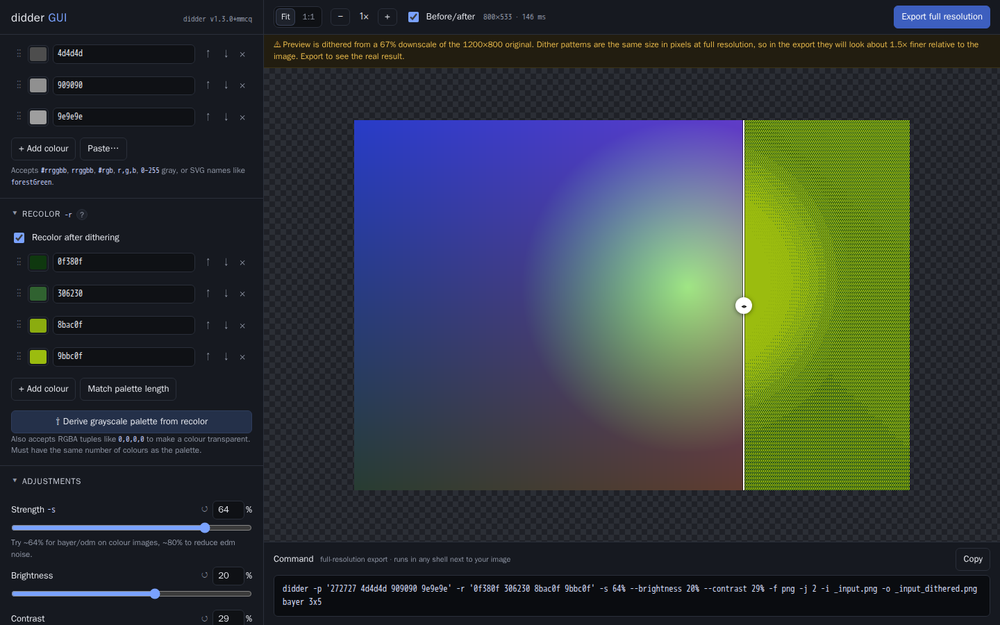

# didder GUI

A local web GUI for [didder](https://github.com/makeworld-the-better-one/didder),
the image dithering CLI, with a live preview that re-renders as you change settings.



- **All of didder's options**: `bayer`, `odm` and `edm` (including custom matrices),
  `random`, palette and recolor editors, `mmcq:N`, adjustments, sizing, output and
  multi-image/animated GIF.
- **The exact `didder` command**, updated live and ready to paste into any shell.
- **Pixel-exact preview.** Every dithered pixel is drawn as a whole block of screen
  pixels, verified at devicePixelRatio 1, 1.25, 1.5, 1.75, 2 and 3.
- **Dithering is done by didder itself.** The app builds the argument list and runs the
  real binary. Pillow is only used to read image dimensions and make the preview copy.

---

## Quick start (Docker)

```sh
docker compose up -d --build
```

Then open <http://127.0.0.1:8000>. The port is published on one host interface,
never `0.0.0.0`: loopback by default, or the address in `DITHER_BIND_ADDR`, which
Compose reads from `.env`:

```sh
# .env
DITHER_BIND_ADDR=127.0.0.1     # then open http://127.0.0.1:8000
```

The app has no authentication, so anyone who can reach that address can use it.

Uploads and exports are kept in `./work` on the host (a bind mount), so they survive
restarts, and in-progress sessions are restored when the app starts again. Each
session's files are in `./work/sessions/<id>/` under `originals/`, `preview/` and
`export/<timestamp>/`. Sessions idle for 6 hours are removed automatically.

**In the browser**, the page also keeps a copy of each uploaded file in IndexedDB (as
raw file data, not base64, so there's no size overhead and no ~5 MB localStorage
limit). Your settings, named presets and session id are in localStorage. After a
reload the page reconnects to its server session; if that session has expired or
been cleaned up, it uploads the stored copies again automatically. Removing an image
with × also removes it from the browser. The copies stay in the browser that uploaded
them; another browser or device starts empty.

**File ownership.** The container runs as a non-root user whose uid/gid default to
`1000:1000` so that it can write to `./work`. If your host uid is different, build
with your own:

```sh
APP_UID=$(id -u) APP_GID=$(id -g) docker compose up -d --build
```

Useful commands:

```sh
docker compose ps                   # health: "healthy" once didder is confirmed callable
curl -s "${DITHER_BIND_ADDR:-127.0.0.1}:8000/healthz"  # {"status":"ok","didder":"didder v1.3.0+mmcq",...}
docker compose logs -f dither-ui
docker compose down                 # ./work is kept
```

### What the compose file sets up

| | |
|---|---|
| Port | `${DITHER_BIND_ADDR:-127.0.0.1}:8000`, a single interface |
| Storage | `./work:/work` bind mount |
| Restart | `unless-stopped` |
| Healthcheck | `GET /healthz`, which runs `didder --version` (fails if didder can't be executed) |
| Limits | 2 CPUs, 1 GB RAM, 128 pids |
| Hardening | read-only root filesystem, all capabilities dropped, `no-new-privileges`, non-root user |

`-j/--threads` defaults to the container's CPU quota (read from cgroup v2 `cpu.max`,
with a v1 fallback), not `os.cpu_count()`, which reports every core on the host. With
`cpus: 2.0` the default is 2 even on a 4-core host. Change `cpus:` and the default
follows.

---

## Development without Docker

didder is found on `PATH` (or through `DIDDER_BIN`). Nothing refers to container paths.

```sh
# 1. didder — either of:
go install github.com/makeworld-the-better-one/didder@v1.3.0        # tagged release
go install github.com/makeworld-the-better-one/didder@408a18aef878b456fe5cdbec406070fd5bd5c2d2  # + mmcq

# 2. the app
python3 -m venv .venv && . .venv/bin/activate
pip install -r requirements-dev.txt
uvicorn app.main:app --reload --host 127.0.0.1 --port 8000
```

Uploads go to `./work` by default (set `DIDDER_WORK_DIR` to change it). If didder
can't be found, the app refuses to start and says how to fix it:

```
 FATAL: the 'didder' binary was not found (looked for 'didder').
  ...
      go install github.com/makeworld-the-better-one/didder@v1.3.0
  or point at a specific binary:  DIDDER_BIN=/path/to/didder
ERROR:    Application startup failed. Exiting.
```

The frontend is plain HTML, CSS and JavaScript in `app/static/`. There's no build step,
so edit the files and reload the page.

### Configuration

| Variable | Default | |
|---|---|---|
| `DIDDER_BIN` | `didder` | Name on `PATH`, or an absolute path |
| `DIDDER_WORK_DIR` | `./work` | Uploads, previews, exports |
| `DIDDER_MAX_UPLOAD_MB` | `32` | Per-file limit |
| `DIDDER_MAX_REQUEST_MB` | `256` | Whole-request limit, enforced while the upload streams in |
| `DIDDER_MAX_FILES` | `48` | Images per session |
| `DIDDER_MAX_PIXELS` | `80000000` | Decompression-bomb guard |
| `DIDDER_PREVIEW_LONG_EDGE` | `800` | Long edge of the preview copy, in pixels |
| `DIDDER_SESSION_TTL` | `21600` | Idle seconds before a session is deleted |
| `DIDDER_RENDER_TIMEOUT` | `120` | Seconds before a didder run is killed |

---

## Rebuilding when didder changes

didder is built from source in the first stage of the Dockerfile, at a pinned ref:

```dockerfile
ARG DIDDER_REF=408a18aef878b456fe5cdbec406070fd5bd5c2d2
ARG DIDDER_VERSION=v1.3.0+mmcq
```

**Why a commit and not the `v1.3.0` tag:** v1.3.0 (December 2022) is the latest
release, but `-p mmcq:N` was added to `main` after it and hasn't been released yet. The
pinned commit is just as reproducible as a tag, and it has `mmcq`.

To move to a new release (or back to v1.3.0), change the build args in
`docker-compose.yml`:

```yaml
    build:
      args:
        DIDDER_REF: v1.4.0          # a tag or a commit SHA
        DIDDER_VERSION: v1.4.0      # the string `didder --version` reports
```

then rebuild. `--pull` fetches newer `golang:alpine` and `python:3.12-slim` bases:

```sh
docker compose build --pull
docker compose up -d
curl -s 127.0.0.1:8000/healthz    # confirm the reported version
```

The build fails if the new binary can't run `didder --version`. When the app starts it
checks whether the binary accepts `mmcq:N`. If it doesn't (for example, when built from
`v1.3.0`), the `mmcq:N` option is disabled in the UI with an explanation, and
everything else keeps working.

If a new didder release adds matrices or flags, update `app/spec.py`: `ODM_NAMES`,
`EDM_NAMES`, the `Params` model, and `build_argv()`.

---

## How it works

**Live preview.** Each change is debounced by 150 ms. The server validates the
settings and returns the command, then runs didder on the preview copy. Every request
has an increasing id. When a new one arrives, the previous `fetch` is aborted, the
server **kills the didder process that is still running**, and any result that arrives
late is dropped (HTTP 409). This keeps an older render from ever replacing a newer one.

**Preview vs. export.** The preview is dithered from a copy scaled down to 800 px on
the long edge. Dither patterns are the same size in pixels at any resolution, so they
cover a bigger share of the image in the preview than in the export. The UI shows a
warning with the actual scale. Width and height (`-x`/`-y`) are scaled into the
preview proportionally, and `-u` is applied as is. **Export** runs the same parameters
on the original file and downloads the result.

**Pixel-exact display.** The preview is never scaled by a fractional amount: zoom is
always a whole number of device pixels per image pixel. At 1:1 one image pixel is one
physical screen pixel, even on HiDPI displays. "Fit" chooses the largest whole number
that fits the window; a preview that doesn't fit at 1x scrolls instead of shrinking.

`image-rendering: pixelated` on an `` wasn't enough to guarantee this. Browsers
round each edge of an element to whole pixels separately. When an element starts
half a pixel off the grid, which is common on HiDPI screens, the two edges round
differently and a row or column of the dither is dropped or doubled. In Chromium at
DPR 2, a 533-row preview was drawn as 532 rows. So the preview is drawn on a `<canvas>`
whose internal resolution matches its size in device pixels exactly. It's drawn at a
whole-number scale with smoothing off (and `image-rendering: pixelated` is still set).
The canvas size and position, and the scroll offset of the preview area, are aligned
to whole CSS pixels and whole device pixels at the same time. `tests/ui_check.py`
checks the result by comparing screenshots pixel-for-pixel with didder's actual output.

**The command** is the full-resolution command, and it uses your original file names
(`-i photo.jpg -o photo_dithered.png`) instead of paths inside the container, so you can
run it in any shell in the folder where your image is. Settings left at didder's
defaults are omitted. The app builds the command as a list of arguments and never
passes it through a shell; the quoting you see exists only so the text can be pasted
into a terminal.

**Recolor.** didder's advice is to dither to a grayscale palette, then recolor to the
target colours. Dithering straight into a narrow palette (all greens, say) forces a
colour image into one hue and loses contrast. **Derive grayscale palette from
recolor** sets `--palette` to the luminance of each recolor colour, using the Rec.601
formula that didder's own grayscale conversion uses. The Game Boy preset is built the
same way. Recolor colours are matched to palette colours by position, and the two lists
must be the same length. Turning recolor on resizes the list to match.

---

## Validation and safety

- **No shell.** didder runs through `asyncio.create_subprocess_exec` with a list of
  arguments. User input never becomes part of a shell command.
- **Everything is checked by the server before didder runs**, using a strict schema
  that rejects unknown fields. Checks cover the Bayer sizes didder accepts (powers of
  two plus 3x3, 3x5 and 5x3, never 1x1), matrix names, custom-matrix JSON (rectangular
  rows, `max` ≠ 0), each colour in the palette and recolor lists (the same four formats
  didder accepts, with 147 colour names copied from didder's own list), recolor length
  equal to the palette length, `mmcq` N as a power of two, GIF with at most 256
  colours, whole-number upscale, percentage ranges, random minimum ≤ maximum, and
  same-size frames for animated GIFs. Problems are shown **next to the setting** (a
  bad colour is marked on its own swatch), not as a crash.
- **didder's own error messages** are shown word for word in a banner you can dismiss.
  didder prints its errors to **stdout**, not stderr, so the app reports both streams.
- **Paths:** uploaded file names are reduced to a plain name. Every file the app reads
  or serves is checked against the work directory, and session ids are strictly
  formatted, so nothing outside the work directory can be reached.
- **Uploads** must have an image content type and extension and must actually open as
  an image. Size is limited per file and per request (see
  [Configuration](#configuration)).

### Differences from the original spec

- **didder is pinned to a `main` commit instead of the v1.3.0 tag**, because `mmcq:N`
  is only on `main`. [Rebuilding](#rebuilding-when-didder-changes) explains how to
  switch.
- **Custom matrices are passed to didder as inline JSON**, not written to a temp file.
  didder accepts inline JSON directly, and since no shell is involved there are no
  quoting problems. This also keeps the copied command self-contained.
- **The backend is a few small modules** instead of one file: `main.py` (routes,
  sessions, subprocesses), `spec.py` (validation and command building), `palettes.py`
  and `colornames.py`.
- **`--no-overwrite`** only affects the copied command. Exports made in the app always
  go into a new folder, so the flag never has an effect there.

---

## Tests

```sh
pytest -q                               # 48 unit tests: validation and command building (no Docker)
python tests/e2e_smoke.py               # 68 API checks against a running instance

# Browser checks (Playwright): pixel-exact rendering at DPR 1–3, live preview,
# field errors, cancellation, before/after, export download, presets.
# Runs as your user so the screenshots in tests/screens/ stay yours.
docker run --rm --network host --user "$(id -u):$(id -g)" -e HOME=/tmp \
  -v "$PWD:/w" -w /w mcr.microsoft.com/playwright/python:v1.55.0-noble \
  sh -c "pip install -q --user playwright==1.55.0 pillow && python tests/ui_check.py"
```

## Layout

```
Dockerfile            multi-stage: golang:alpine builds didder → python:3.12-slim runtime
docker-compose.yml    service `dither-ui`
app/main.py           FastAPI app: upload, preview, export, healthz, sessions
app/spec.py           didder options: validation and command building
app/palettes.py       palette presets
app/colornames.py     SVG colour names (didder's table)
app/static/           index.html, style.css, app.js (no build step)
tests/                unit, API and browser tests
```
